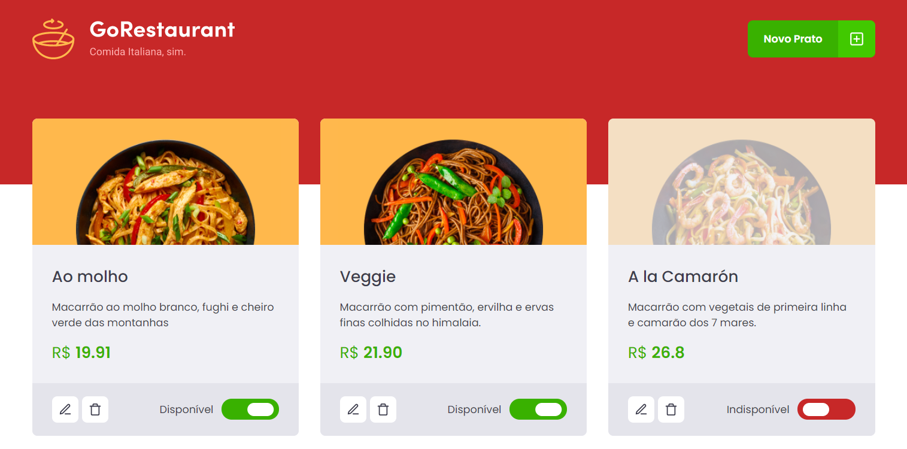

<h3 align="center">
  Desafio 02 do capítulo 02 do curso Ignite da Rocketseat
</h3>
<p align="center">
  
</p>

<p align="center">
  <a href="https://farsoft.com.br">
    
  </a>

  <a href="https://www.github.com/farnetani/">
    
  </a>
</p>

<br>

## :rocket: Sobre o aplicativo

Converter uma aplicação pronta em React com componentes de classe em javascript em componentes funcionais e em typescript.

[Detalhes sobre o desafio](https://www.notion.so/Desafio-02-Refactoring-de-classes-e-typescript-4571541e7f8c4799bd191b6cfb53802c)

[Componente Funcional x Componente de Classe](https://www.notion.so/Componentes-no-React-6644d41da663405cb29dcaae1693bb9f)

<br>

## :wrench: Instalação e Uso

```bash

### `yarn start`

### `yarn build`

```

<br>

## :memo: Licença

Esse projeto está sob a licença MIT. Veja o arquivo [LICENSE](/LICENSE) para mais detalhes.


Feito com :heart: por [Arlei F. Farnetani Junior](https://github.com/farnetani)

[](https://img.shields.io/github/followers/farnetani?style=social)
[](https://www.instagram.com/farnetanijr)
[](https://www.facebook.com/farnetanijr)
[](mailto:farnetani@gmail.com)
[](https://www.linkedin.com/in/farnetani/)

